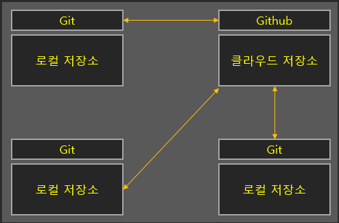

# Git과 Github
 ---- - -- - - -
###Git
Git은 로컬 파일의 변경사항을 기록하고, 해당 파일에 대한 여러 사용자 간의 작업을 조율하기 위한 버전 컨트롤 시스템(VCS : Version Control System)이다.
레포지토리(Repository)라고 불리는 디랙터리 하위 파일들의 삭제와 생성, 수정을 추적하여 버전을 관리한다.

예를들어, 카카오톡 앱을 개발하는 파일을 관리하는 것을 생각해보면 개발자들은 이 파일을 필요에 따라 다른 버전이 필요할 수도 있다. Ex) 2023년 3월까지 출시해야하는 버전과, 버그로 인한 핫픽스 되어야하는 버전 등

Git은 이런 과정을 더 세분화해서 나눌 수 있고, 조금 더 체계적으로 관리할 수 있도록 도와준다. 위 예시로 출시해야하는 버전, 핫픽스 버전 즉, 두 개의 버전으로 나눈 것을 브랜치(Branch)라고 하고 이렇게 나눈 각각의 버전을 시간순으로 구분한 것을 커밋(Commit)이라고 말한다.

즉, Git은 항상 나의 파일을 보고있고, 모든 파일의 변화를 기록하고 변화된 내용을 추적한다. Ex) 무엇이 변경되었고, 어디서 몇번 몇시에 누가 변경했는지

그리고 같은 파일에 대해 각기 다른 버전을 보관할 수 있어 버전관리에 용이하고, 같은 파일을 가지고 여러명과 함께 협업할 수 있다.
### Github
Github는 클라우드에 있는 깃 제공자이다. 내 컴퓨터에서 Git히스토리를 가져와 Github웹 사이트에 업로드(Push)하는 방식이다. 협업자가 Github에서 올린 자료를 가져올 수 있다. 각각(협업하는 개발자)의 변화기록을 Github에 보내기 때문에 변화내용을 올리고 교환할 수 있다.

### 문제
1. Git과 Github이란?
2. Git으로 협업하는 방법을 설명하세요.
3. Branch와 Commit에 대해서 설명하세요.

### 출처
https://codevang.tistory.com/217

https://yozm.wishket.com/magazine/detail/1674/

https://www.youtube.com/watch?v=YFNQwo7iTNc

