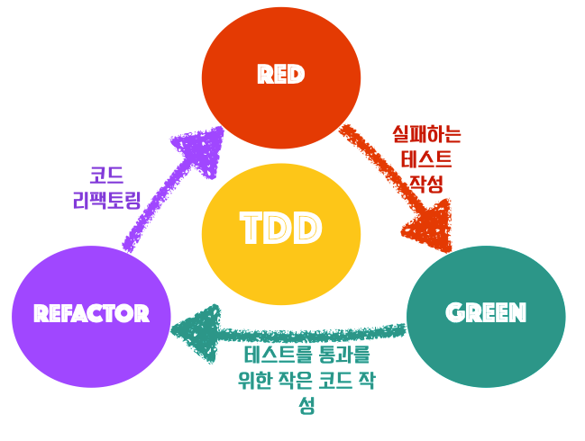

# TDD의 의미와 장점
- ---------
TDD(Test Driven Development)테스트 주도 개발은 소프트웨어 개발 방법론 중 하나이다.

개발자가 테스트 케이스를 먼저 작성하고, 이를 통과하는 코드를 작성하는 방식으로 개발을 진행한다.

이 방식은 코드 품질을 높이고 유지 보수를 용이하게 만든다.

## TDD의 개발 프로세스
TDD의 개발 프로세스는 다음과 같이 진행된다.

`요구사항 분석` -> `자세한 설계` -> `테스트 작성` -> `코드 작성` -> `리팩토링`




코드 작성 이전에 테스트를 먼저 작성하는게 다른 개발 프로세스와 큰 차이점이다.

위 그림에서 각각의 의미는 다음과 같다.
- `RED` : 실패하는 테스트 코드 작성하기
- `GREEN` : 테스트에 통과할 만한 작은 코드 작성하기
- `REFACTOR` : 코드를 조금 더 효율적으로 리팩토링하기

즉 **테스트 코드**를 먼저 작성하고, 그 다음 **동작하는 코드를 작성**한뒤 이 코드를 **리팩토링**하는 형태를 반복하는 것.

## TDD를 사용하는 목적
- 코드의 품질과 유지보수성을 높힌다.
- 버그를 빠르게 발견하고 수정한다.
- 개발속도를 향상 시킨다. -> 초기 개발엔 시간이 걸리지만, 나중에 발생하는 버그와 결함을 줄임.

다만, TDD는 모든 상황에 항상 적용될 수 있는 것은 아니다. 시간이나 비용이 정해진 프로젝트에선 추가적인 테스트 코드 작성과
실행에 대한 시간과 비용이 필요하기 때문에 잘 고려해서 사용해야한다.

## TDD의 장점
위에서 설명한 대부분이 TDD의 장점이다.

1. 코드 품질 개선

   - 요구 사항을 명확하게 정의하므로 충족시키는 코드를 작성할 수 있다.
   - 테스트 코드를 먼저 작성하기 때문에 코드의 품질이 높아진다.
   

2. 유지 보수에 용이

    - 코드가 더 간결하고 가독성이 좋아진다.
    - 테스트 코드가 남아있어서 수정시 기능이 잘 동작하는지 파악하기 쉽다.


3. 버그 발견 및 수정에 용이

    - 테스트 코드를 작성하면서 예상치 못한 버그를 발견하고, 수정하는 작업을 수행하기 때문.


4. 개발 속도 향상

    - 테스트 코드를 작성하면서 발생할 수 있는 오류를 미리 예측하여 방지할 수 있다.
    - 테스트 코드를 기반으로 프로덕션 코드를 작성하는데, 이러한 과정에서 불필요한 코드와 복잡도를 줄 일 수 있다. -> 코드 작성에 소요되는 시간 감소 .


## TDD 적용해보기
TDD 개발 프로세스를 참고하여 두 수를 더하는 함수를 만든다고 가정하고, TDD를 간단하게 적용해보자.

1. 실패하는 테스트 케이스 작성하기

```kotlin
class CalculatorTest {
    @Test // Junit 라이브러리 테스트 메소드를 선언할 때 사용
    fun testAddition() {
        val cal = Calculator()
        val result = cal.add(2, 3)
        assertEquals(5, result) // 예상되는 값과 결과값 넣기
    }
}

위 테스트 코드는 실패한다. 아직 Calculator의 add함수가 구현이 되지 않았다.
```


2. 테스트를 통과하는 코드 작성하기

```kotlin
class Calculator {
    fun add(a: Int, b: Int) = a + b
}

이제 add함수를 작성했으므로 테스트를 통과시킬 수 있다. 테스트 케이스를 통과한 후에 코드를 리팩토링할 수 있다.
```


3. 리팩토링하기

```kotlin
class Calculator {
    fun add(vararg numbers: Int) = numbers.sum()
}

리팩토링을 통해서 add함수의 코드를 개선하고 가독성과 유지보수성을 높혔다.
가변인자 vararg 통해서 두 수 뿐만아니라, 여러가지의 수가 요청이 와도 수정할 필요가 없다.
```


위 예제는 간단한 예제지만, 기능이 더 많을수록 TDD의 사이클이 여러번 돌 것 같다.

평소 테스트 코드를 작성하는 습관을 길들일 것.


## 문제
1. TDD에서 테스트 케이스를 작성할 때 고려해야하는 사항은 무엇인가요?
2. TDD를 적용하여 개발하는 과정에서 발생할 수 있는 문제점은 무엇이 있을까요?


