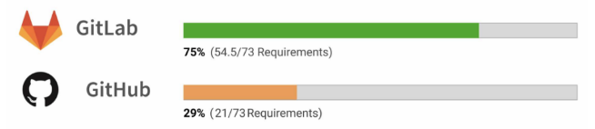

# Git과 github

## Git

> Git은 형상 관리 도구 중 하나로, 컴퓨터 파일의 변경사항을 추적하고 여러 명의 사용자들 간에 해당 파일들의 작업을 조율하기 위한 분산 버전 관리 시스템이다.

- 분산 버전 관리 시스템으로, 소스 코드와 같은 파일의 변경 내용을 추적하고 관리하는 도구
- 로컬 컴퓨터에서 작업하고 변경된 파일의 버전을 저장하며, 필요에 따라 변경내용을 다른 개발자들과 공유 가능
- Git은 개발자들이 효율적으로 코드를 공유하고 협업하며 버전을 관리할 수 있도록 도와줌
- Git은 프로젝트 폴더 내에서 `.git` 이란 폴더내에 작업을 기록하고, 버전 관리를 통해 체계적인 개발이 가능하도록 함
- 더 자세한 기록은 [Git 공식 사이트](https://git-scm.com/book/ko/v2) 참고

### .git 파일

> Git이 프로젝트를 관리하는 데 필요한 모든 정보가 포함되어 있는 폴더

Git 저장소의 핵심. Git 저장소에는 모든 버전 관리 기록이 포함되어 있음

- 포함된 내용
  ```
  1. HEAD 파일 : 현재 작업중인 브랜치의 포인터를 가르킴
  2. config 파일 : Git 저장소의 설정을 저장
  3. description 파일 : 웹 인터페이스에서 저장소를 설명하는 파일
  4. hooks 디렉토리 : Git 저장소에 특정 이벤트가 발생할 때 실행될 스크립트를 포함
  5. index 파일 : Git이 현재 추적하고 있는 파일들의 상태를 저장
  6. object 디렉토리 : Git이 추적하는 모든 파일의 데이터가 여기에 저장됨
  7. refs 디렉토리 : Git 브랜치와 태그를 포함
  ```

### 용어정리

- `fork`
  - 특정 repository를 수정 및 추가 기능을 넣고 싶을 때 해당 repository를 자신의 원격저장소에 그대로 복제하는 기능
  - fork한 저장소는 원본과 연결되어 있어 새로운 commit이 생기면 그대로 repository에 반영 가능 (이 과정중에 fetch, rebase, pull등 과정 필요)
  - <b style='color:red'>git의 기능이 아니라 git의 기능을 추상화해서 제공하는 github의 기능</b>
- `clone`
  - 특정 repository를 자신의 local에 복사하여 새로운 저장소를 만듦
  - clone한 원본 repository를 remote 저장소 origin으로 가지고 있으며 권한이 없는 경우 해당 저장소로 push 불가능
  ```
  git clone <repository 주소>
  ```
- `branch`, `checkout`

  - 독립적으로 어떤 작업을 진행하기 위한 개념
  - 각각의 브랜치는 다른 브랜치의 영향을 받지 않기 때문에 여러 작업을 동시에 진행 가능
  - 브랜치는 또 다른 브랜치와 병합(Merge)함으로써, 각각 작업한 내용을 합치기 가능

  ```
  git branch <이름>
  -> <이름> 브랜치 생성

  git checkout <이름>
  -> <이름>의 브랜치를 HEAD로 지정 ('*'표시로 확인가능)

  git checkout -b <이름>
  -> <이름> 브랜치 생성과 HEAD지정 동시에 실행
  ```

- `commit`, `push`

  - commit은 작업한 모든 파일과 파일의 데이터를 사진 찍듯이 복사해서 저장소에 보관하는 개념
  - 보관해놓은 commit들을 연동해놓은 repository에 push를 통해 올리기
  - commit, push 과정

  ```
     1. git add .
       -> 변경한 모든 작업을 올린다
     2. git commit
       -> vi 이용해서 commit (한문장으로 정리하기힘든 commit 넣기 유용함)
     2-1. git commit -m "내용"
       -> 간단한 커밋내용을 추가하여 commit
     3. git push origin <브랜치이름>
       -> origin <브랜치이름>에 커밋되어 있는 내용들을 원격 repository에 올리기
  ```

- `pull request(PR)`

  - 코드 충돌을 최소화 할 수 있고 push 권한이 없는 오픈 소스 프로젝트에 기여할 때 많이 사용
  - pull request 과정

  ```
     1. fork
       -> 타겟 프로젝트의 repository를 자신의 원격 repository에 fork
     2. clone, remote 설정
       -> fork한 repository를 clone
     3. branch 생성
       -> 자신의 로컬컴퓨터에서 코드 추가하는 작업은 branch를 따서 진행
     4. 수정, 작업 후 commit, push 진행
       -> 작업완료 후 자신의 원격 repository(origin)에 commit, push진행
     5. pull request 생성
       -> push 후 본인 원격 repository에 접속해 pull request진행
     6. merge pull request
       -> PR을 받은 원본 repository관리자가 내용 확인 후 merge여부 결정
  ```

- `fetch`, `pull`

  - <b>fetch</b>는 원격 저장소의 최신 이력 확인 후 최신 commit 이력을 가져오면서 나의 로컬 저장소는 로컬의 최신 commit을 가르킴
  - <b>pull</b>도 똑같이 원격 저장소의 최신 이력 확인 후 최신 commit이력을 가져오지만 <b style='color: red'>나의 로컬 저장소 또한 원격 저장소의 최신 commit을 가르킴</b>

- `rebase`, `merge`
  - master에 다른 branch를 병합할 때 쓰이는 merge, rebase 두 가지 방법이 존재
  - merge는 두 개의 브랜치를 병합하는 기능. 일반적으로 두 브랜치의 커밋 히스토리를 유지하면서 브랜치를 병합할 때 사용
    > merge를 사용하면 병합 후 변경 내용을 확인할 수 있으며, 병합이 실패할 경우에도 원래 브랜치로 되돌릴 수 있음
  - rebase는 커밋 히스토리를 수정하여 브랜치를 합치는 방법. 일반적으로 Git의 히스토리를 깨뜨리지 않고 브랜치를 합칠 때 사용
    > 커밋 히스토리를 선형으로 유지하기 때문에 브랜치 간에 충돌이 발생하는 경우 충돌이 덜 발생할 수 있음. 그러나 rebase 사용 시, 커밋 히스토리가 수정되므로, 원래 브랜치로 되돌리기가 어려울 수 있음
  - 즉, merge는 브랜치를 유지하면서 병합하고 싶을 때 사용되며, rebase는 커밋 히스토리를 깨뜨리지 않으면서 브랜치를 합치고 싶을 때 사용.
  - <b>rebase는 커밋 이력을 깔끔하게 관리하는 경우에 자주 사용함</b>
  - [merge, rebase 차이점 참고 링크](https://dongminyoon.tistory.com/9)

---

## Github

> Github는 분산 버전 관리 툴인 깃(Git)를 사용하는 프로젝트를 지원하는 웹호스팅 서비스

- Git 기반의 웹 호스팅 서비스로, Git을 사용하여 소스 코드를 관리하는 개발자들이 저장소를 만들어서 코드를 업로드하고 공유할 수 있는 플랫폼
- 개발자들이 오픈 소스 프로젝트를 공유하고, 개발자 간의 협업을 편리하게 관리할 수 있도록 돕는다.

최종적으로 `Git`은 소스 코드 관리 도구이고, `Github`는 Git 기반의 소스 코드 호스팅 및 협업 플랫폼

---

## Gitlab과 Github

### Gitlab

> Git을 기반으로하는 웹 호스팅 서비스 및 버전 제어 시스템을 갖춘 Github의 또 다른 대안

- 비공개된 Github
- 중앙 서버에서 Git 저장소를 관리하는 방법

#### 실무에서의 차이



[github vs gitlab 차이](https://about.gitlab.com/competition/github/?stage=Govern&feature=Team%20Planning%E3%85%81)

### 질문지

1. 병합작업 시 merge와 rebase간의 차이점
2. Gitlab과 Github의 차이점
3.
